## Project 2 Inventory Management

- Product Page Get All
  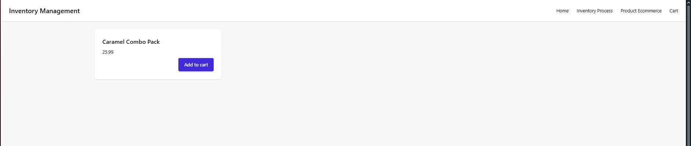
- Cart Page Get All
  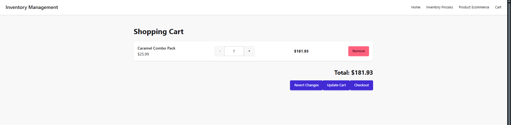

- Cart API Get by userId
  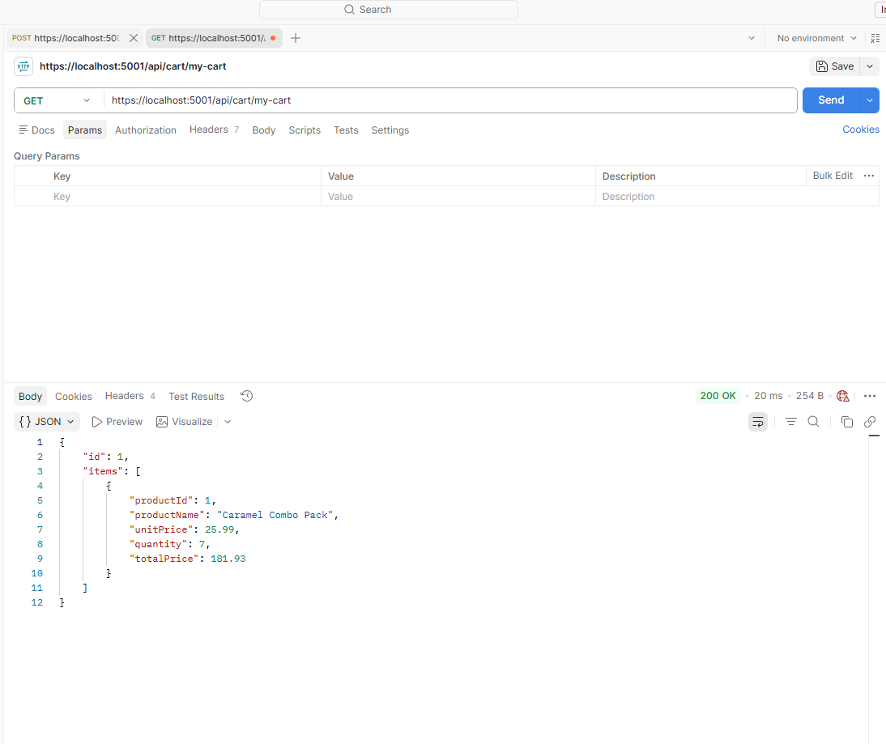

- Item CRUD using Tanstack Form and Mutation
  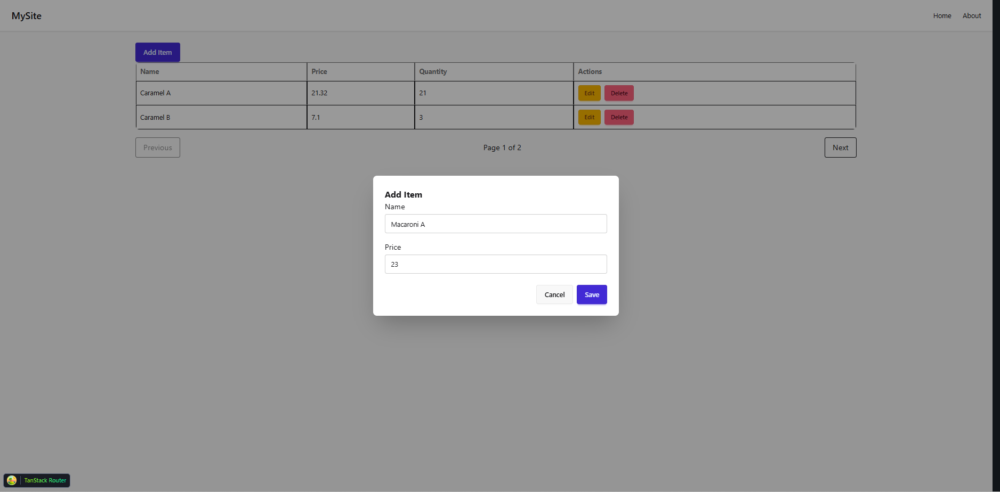

- Tanstack Query and Mutation for Item CRUD
  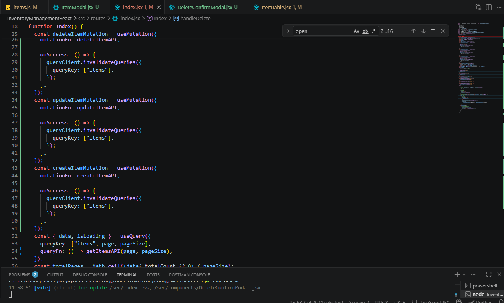

- Item Get All using pagination
  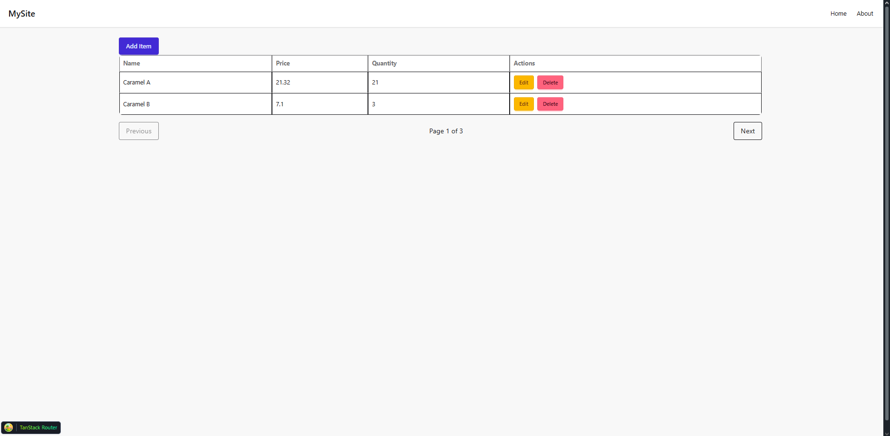

- Generate Dummy Inventory Process in React using TanQuery
  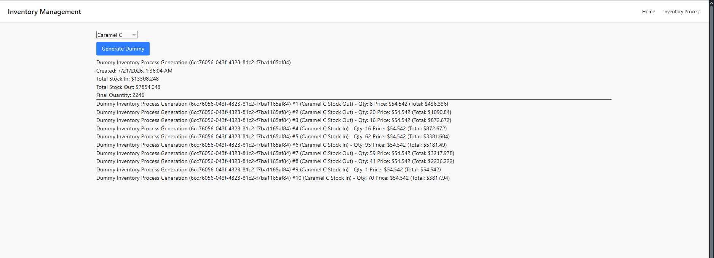

- Generate Dummy Inventory Process API using .NET and Postman
  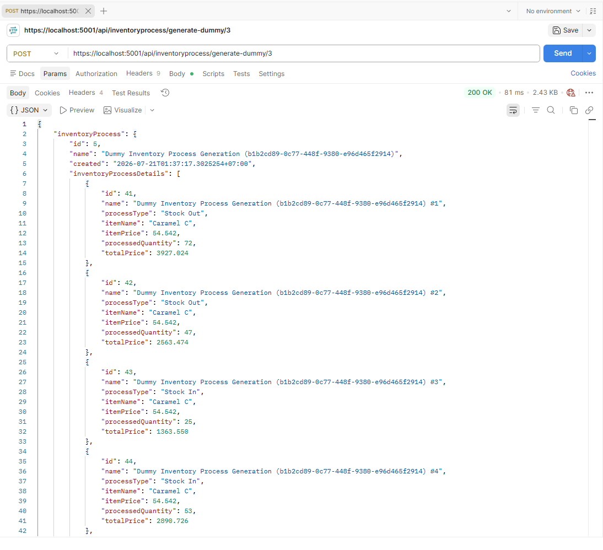

## Project 1 Finance Tracker

- Generate random finance using int count as query
  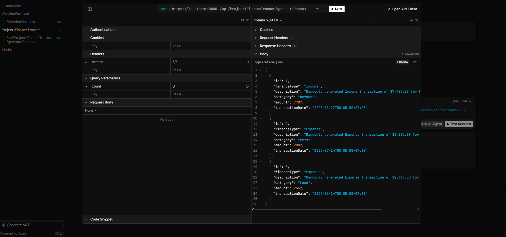

- Generate all finance with pagination
  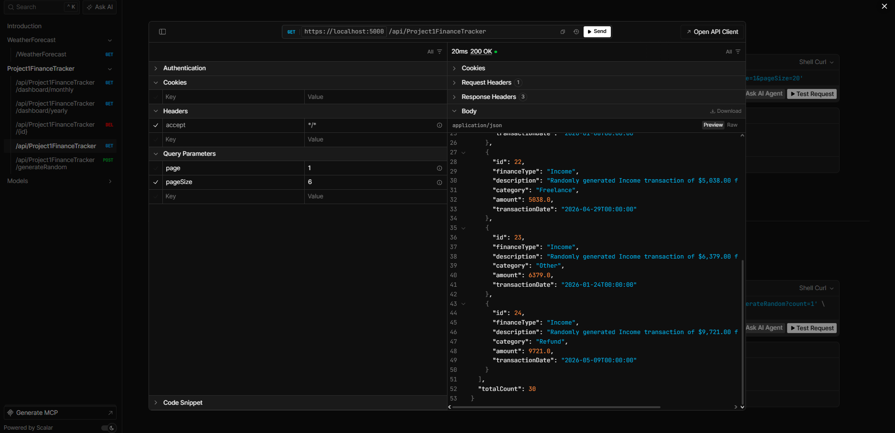

- Generate monthly dashboard using int year and int month as query
  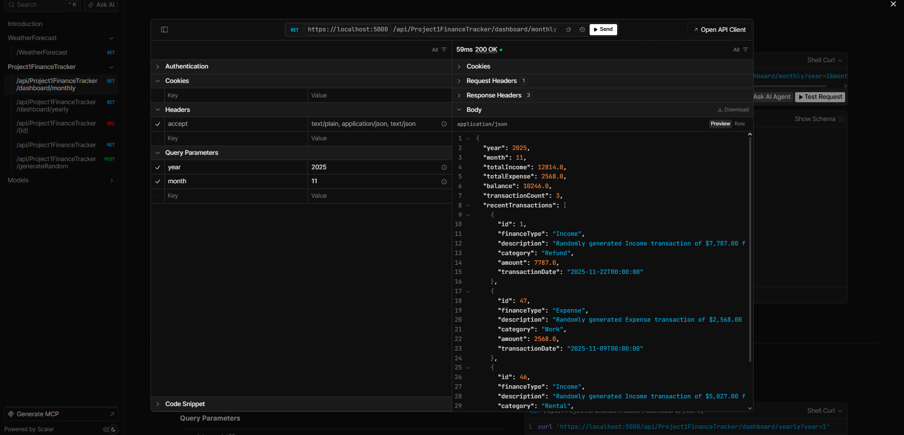

- Generate yearly dashboard using int year as query
  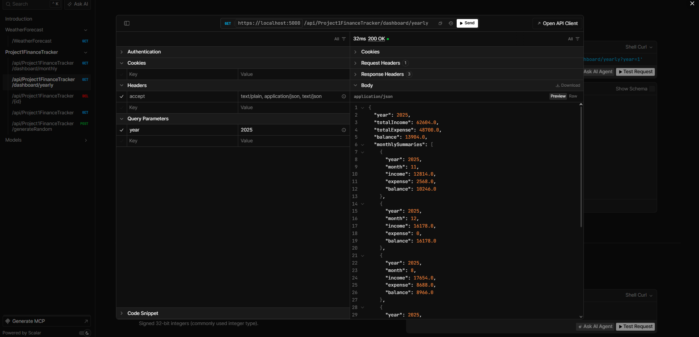

- Generate sorting and searching functionality for datatable filtering
  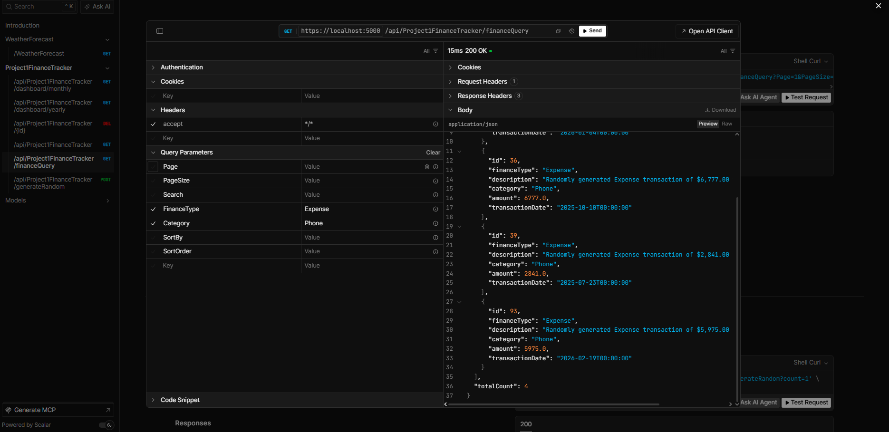

- Get all finance with pagination react component
  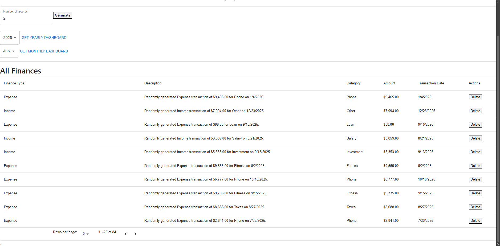

- Yearly and monthly dashboard react component
  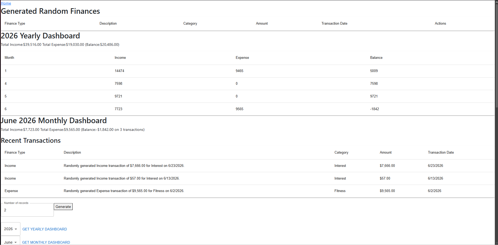

- Yearly bar chart dashboard react component
  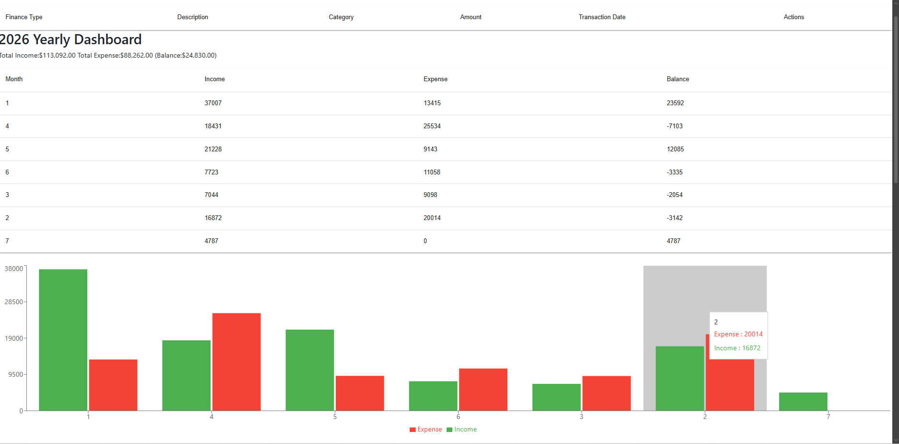

- Monthly pie chart dashboard react component
  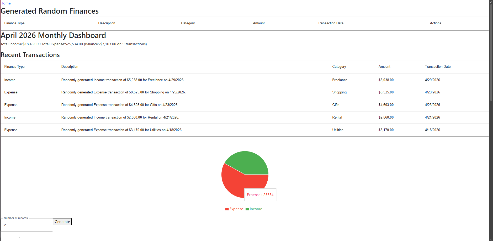
